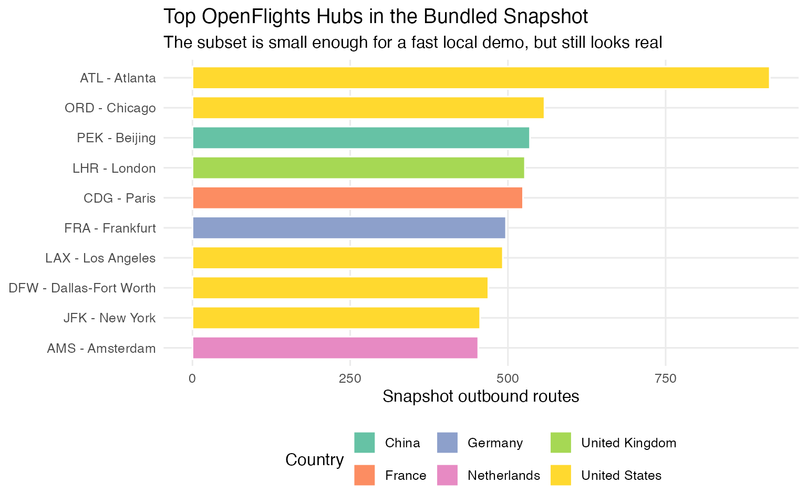
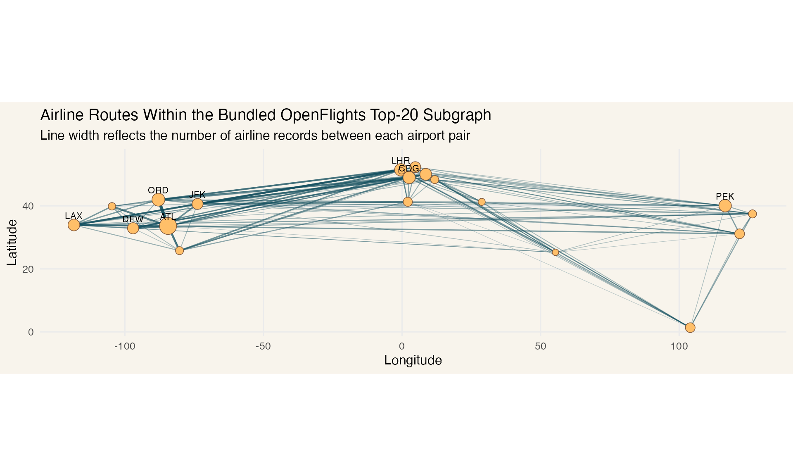

# OpenFlights Analysis with grafeoR

``` r

library(grafeoR)
library(ggplot2)
```

The package ships with a compact real-world OpenFlights subset so you
can test the Rust binding against graph data that looks like an actual
transport network, not just toy nodes and edges.

The bundled sample contains:

- the 20 airports with the highest outbound route counts in the upstream
  OpenFlights snapshot
- the 1,129 airline route records whose source and destination are both
  inside that 20-airport subset

``` r

sample <- openflights_sample_data()

dim(sample$airports)
#> [1] 20  7
dim(sample$routes)
#> [1] 1129    5
head(sample$airports[, c("iata", "city", "country", "snapshot_outbound_routes")])
#>   iata      city        country snapshot_outbound_routes
#> 1  ATL   Atlanta  United States                      915
#> 2  ORD   Chicago  United States                      558
#> 3  PEK   Beijing          China                      535
#> 4  LHR    London United Kingdom                      527
#> 5  CDG     Paris         France                      524
#> 6  FRA Frankfurt        Germany                      497
head(sample$routes)
#>   airline source_iata dest_iata stops equipment
#> 1      DL         AMS       ATL     0   333 76W
#> 2      KL         AMS       ATL     0       777
#> 3      HV         AMS       BCN     0   73H 73W
#> 4      IB         AMS       BCN     0       320
#> 5      KL         AMS       BCN     0       737
#> 6      MU         AMS       BCN     0       737
```

## Load the graph into Grafeo

``` r

gql_string <- function(x) {
  if (is.null(x) || is.na(x)) {
    return("NULL")
  }

  value <- gsub("\\\\", "\\\\\\\\", as.character(x), perl = TRUE)
  value <- gsub("\"", "\\\\\"", value, fixed = TRUE)
  paste0("\"", value, "\"")
}

load_openflights_graph <- function(db, sample) {
  tx <- db$begin()
  on.exit(
    if (tx$is_active()) {
      try(tx$rollback(), silent = TRUE)
    },
    add = TRUE
  )

  for (i in seq_len(nrow(sample$airports))) {
    row <- sample$airports[i, ]
    tx$execute(sprintf(
      paste0(
        "INSERT (:Airport {",
        "iata: %s, name: %s, city: %s, country: %s, ",
        "lat: %.6f, lng: %.6f, snapshot_outbound_routes: %d",
        "})"
      ),
      gql_string(row$iata),
      gql_string(row$name),
      gql_string(row$city),
      gql_string(row$country),
      row$latitude,
      row$longitude,
      as.integer(row$snapshot_outbound_routes)
    ))
  }

  for (i in seq_len(nrow(sample$routes))) {
    row <- sample$routes[i, ]
    tx$execute(sprintf(
      paste0(
        "MATCH (src:Airport {iata: %s}), (dst:Airport {iata: %s}) ",
        "INSERT (src)-[:ROUTE {airline: %s, stops: %d, equipment: %s}]->(dst)"
      ),
      gql_string(row$source_iata),
      gql_string(row$dest_iata),
      gql_string(row$airline),
      as.integer(row$stops),
      gql_string(row$equipment)
    ))
  }

  tx$commit()
  invisible(db)
}
```

``` r

db <- grafeo_db()

load_openflights_graph(db, sample)
db$info()
#> $graph_model
#> [1] "LPG"
#> 
#> $node_count
#> [1] 20
#> 
#> $edge_count
#> [1] 1129
#> 
#> $is_persistent
#> [1] FALSE
#> 
#> $path
#> NULL
#> 
#> $wal_enabled
#> [1] FALSE
#> 
#> $version
#> [1] "0.5.23"
#> 
#> $current_graph
#> NULL
```

## Query airport and route data back into R

For the charts below, `grafeoR` is used to pull nodes and edges back
into R as data frames, and the aggregation for plotting is handled on
the R side.

``` r

airports_tbl <- db$query(
  paste(
    "MATCH (a:Airport)",
    "RETURN a.iata, a.name, a.city, a.country, a.lat, a.lng,",
    "a.snapshot_outbound_routes",
    "ORDER BY a.snapshot_outbound_routes DESC, a.iata"
  )
)

routes_tbl <- db$query(
  paste(
    "MATCH (src:Airport)-[r:ROUTE]->(dst:Airport)",
    "RETURN src.iata, src.lat, src.lng, dst.iata, dst.lat, dst.lng, r.airline"
  )
)

route_segments <- aggregate(
  routes_tbl$r.airline,
  by = list(
    source_iata = routes_tbl$src.iata,
    source_lat = routes_tbl$src.lat,
    source_lng = routes_tbl$src.lng,
    dest_iata = routes_tbl$dst.iata,
    dest_lat = routes_tbl$dst.lat,
    dest_lng = routes_tbl$dst.lng
  ),
  FUN = length
)
names(route_segments)[names(route_segments) == "x"] <- "airline_count"
route_segments <- route_segments[
  order(
    -route_segments$airline_count,
    route_segments$source_iata,
    route_segments$dest_iata
  ),
  ,
]

head(airports_tbl[, c("a.iata", "a.city", "a.country", "a.snapshot_outbound_routes")])
#>   a.iata    a.city      a.country a.snapshot_outbound_routes
#> 1    ATL   Atlanta  United States                        915
#> 2    ORD   Chicago  United States                        558
#> 3    PEK   Beijing          China                        535
#> 4    LHR    London United Kingdom                        527
#> 5    CDG     Paris         France                        524
#> 6    FRA Frankfurt        Germany                        497
head(route_segments)
#>    source_iata source_lat source_lng dest_iata dest_lat   dest_lng
#> 55         ORD    41.9786 -87.904800       ATL  33.6367 -84.428101
#> 40         ATL    33.6367 -84.428101       ORD  41.9786 -87.904800
#> 69         ATL    33.6367 -84.428101       MIA  25.7932 -80.290604
#> 98         JFK    40.6398 -73.778900       LHR  51.4706  -0.461941
#> 81         LHR    51.4706  -0.461941       JFK  40.6398 -73.778900
#> 56         MIA    25.7932 -80.290604       ATL  33.6367 -84.428101
#>    airline_count
#> 55            20
#> 40            19
#> 69            12
#> 98            12
#> 81            12
#> 56            12
```

## Visualize the hubs

``` r

top_hubs <- airports_tbl[seq_len(min(10L, nrow(airports_tbl))), , drop = FALSE]
top_hubs$airport <- factor(
  paste(top_hubs$a.iata, top_hubs$a.city, sep = " - "),
  levels = rev(paste(top_hubs$a.iata, top_hubs$a.city, sep = " - "))
)

ggplot(
  top_hubs,
  aes(
    x = airport,
    y = a.snapshot_outbound_routes,
    fill = a.country
  )
) +
  geom_col(width = 0.75, color = "white") +
  coord_flip() +
  scale_fill_brewer(palette = "Set2") +
  labs(
    title = "Top OpenFlights Hubs in the Bundled Snapshot",
    subtitle = "The subset is small enough for a fast local demo, but still looks real",
    x = NULL,
    y = "Snapshot outbound routes",
    fill = "Country"
  ) +
  theme_minimal(base_size = 12) +
  theme(
    panel.grid.minor = element_blank(),
    legend.position = "bottom"
  )
```



## Visualize the route network

``` r

labels <- airports_tbl[seq_len(min(10L, nrow(airports_tbl))), , drop = FALSE]

ggplot() +
  geom_segment(
    data = route_segments,
    aes(
      x = source_lng,
      y = source_lat,
      xend = dest_lng,
      yend = dest_lat,
      linewidth = airline_count,
      alpha = airline_count
    ),
    color = "#0f4c5c",
    lineend = "round"
  ) +
  geom_point(
    data = airports_tbl,
    aes(
      x = a.lng,
      y = a.lat,
      size = a.snapshot_outbound_routes
    ),
    shape = 21,
    fill = "#ffbf69",
    color = "#7f5539",
    stroke = 0.4
  ) +
  geom_text(
    data = labels,
    aes(
      x = a.lng,
      y = a.lat,
      label = a.iata
    ),
    size = 3,
    nudge_y = 3,
    check_overlap = TRUE
  ) +
  coord_quickmap() +
  scale_linewidth(range = c(0.2, 1.3), guide = "none") +
  scale_alpha(range = c(0.15, 0.7), guide = "none") +
  scale_size(range = c(2.5, 7), guide = "none") +
  labs(
    title = "Airline Routes Within the Bundled OpenFlights Top-20 Subgraph",
    subtitle = "Line width reflects the number of airline records between each airport pair",
    x = "Longitude",
    y = "Latitude"
  ) +
  theme_minimal(base_size = 12) +
  theme(
    panel.grid.minor = element_blank(),
    plot.background = element_rect(fill = "#f8f4ec", color = NA),
    panel.background = element_rect(fill = "#f8f4ec", color = NA)
  )
```



The bundled sample is documented in
`inst/extdata/openflights-README.md`, including the upstream source URLs
and license attribution to OpenFlights.
